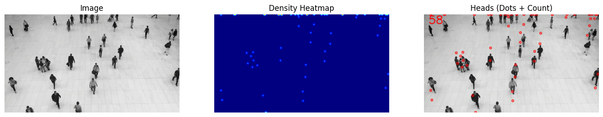

##  Real-World Crowd Density Estimation & Monitoring (CSRNet + MCNN)


This project investigates how two popular crowd-counting architectures — **MCNN (2016)** and **CSRNet (2018)** — behave when deployed in **unconstrained real-world scenes** (railway stations, street markets, beaches, subways).
Models are trained on **ShanghaiTech Part-A** and tested **zero-shot** on a newly curated real-world dataset.

---


###  Repository Structure

```
├── mcnn_partA.pth
├── csrnet_partA_finetuned.pth
├── generate_density.py
├── video_monitor.py
├── real_world/  (images + density maps)
├── notebooks/   (training + evaluation)
└── README.md
```

---

###  Quick Start

####  1. Install dependencies
Create and activate a virtual environment (optional but recommended).

```bash
pip install -r requirements.txt
```

####  2. Generate density maps & counts for extracted frames

```bash
python generate_density.py
```

This will:
• run object-based counting on each frame
• produce `.npy` density maps
• write `counts.csv`

```
Overlay legend:

SAFE     count < 100
WARNING  100 ≤ count < 150
DANGER   count ≥ 150
```

---

### Domain Transfer Highlights

| Model  | Training Data       | Test Data  | MAE     | RMSE     |
| ------ | ------------------- | ---------- | ------- | -------- |
| MCNN   | ShanghaiTech Part-A | Real-world | 1940.49 | 3486.22  |
| CSRNet | ShanghaiTech Part-A | Real-world | 6022.32 | 11548.18 |

Both models severely degrade under real-world domain shift, even though they behave well on ShanghaiTech .

---

###  Failure-Mode Insights

Real-world images where both models struggle generally include:

* night-time lighting & specular reflections
* stalls/banners mistaken as “head blobs”
* large repetitive textures (train roofs, sky gradients)

This explains why applying benchmark-trained models directly in safety-critical use can be risky .

---

###  Future Work

* domain-adaptive pretraining on unlabeled real-world video
* style-transfer augmentation
* lightweight crowd models for low-power edge devices
* temporal modelling from video instead of per-frame prediction

---

###  Authors

This work was completed as part of course **EE782 – IIT Bombay**.

Anuj Yadav[22b3950], Kshitij Kumar Pradhan[22b4215], Archisman Bhattacharjee[22b2405]


## Credit

This project utilizes the model developed by Mehdi Ghasemzadeh to annotate the images.

- Mehdi Ghasemzadeh — Crowd-Counting-YOLOV5: https://github.com/mehdighasemzadeh/Crowd-Counting-YOLOV5

Thank you to Mehdi for releasing useful code and resources that helped inform parts of this project.


